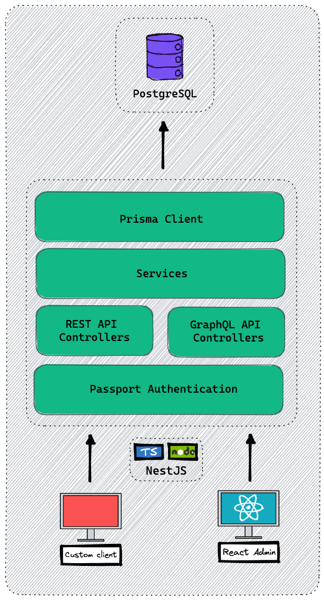

# UTP Node
server side code to implement the universal transaction protocol (utp)

# Technologies
This service is built with the following proven open-source technologies

# Server-side
- [NestJS](https://nestjs.com/) - A progressive Node.js framework for building efficient, reliable and scalable server-side applications.
- [Prisma](https://www.prisma.io/) - Next-generation ORM for Node.js and TypeScript.
- [PostgreSQL](https://www.postgresql.org/) - The world's most advanced open source relational database
- [Passport](https://www.passportjs.org/) - simple auth for Node.js
- [GraphQL](https://graphql.org/) - a query language for APIs.
- [Swagger UI](https://swagger.io/) - Visual documentation for REST API based on OpenAPI Specification.
- [Jest](https://jestjs.io/) - delightful JavaScript Testing Framework with a focus on simplicity.
- [Docker](https://www.docker.com/) - an open platform for developing, shipping, and running applications.

# Client-Side
- [React](https://reactjs.org/) - A JavaScript library for building user interfaces.
- [React-Admin](https://marmelab.com/react-admin/) - A frontend Framework for building B2B applications running in the browser on top of REST/GraphQL APIs, using ES6, React and Material Design.

# Projects Structure
The generated service is built from two projects, each in a separate folder

- server - For all the server components including REST API, GraphQL, Services and more.
- admin - For the Admin UI including forms for CRUD operations on all data models.

# Server
The server project provides all the back-end services of your application, like REST API, GraphQL API, authentication, authorization, logging, data validation, and connection to the database.

# Admin
The Admin project provides a React application with ready-made forms for creating and editing all the data models of your application. The React app is pre-configured to work with the server and comes with all the boilerplate and foundation for your client - routing and navigation, authentication, permissions, menu, breadcrumbs, error handling and much more.